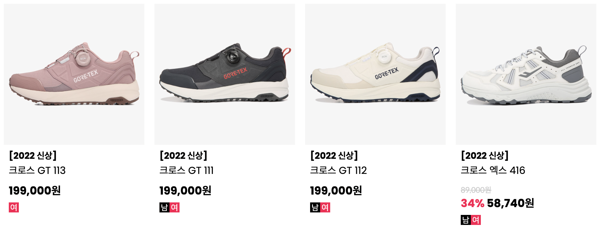
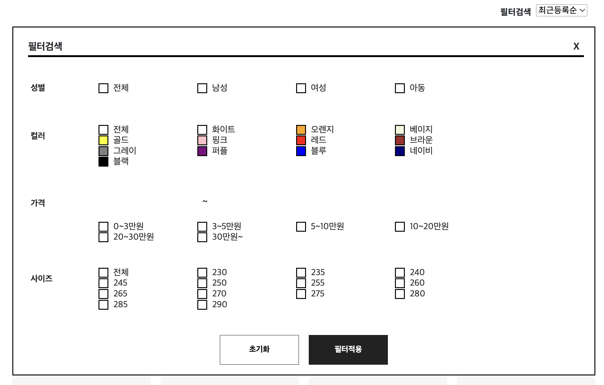
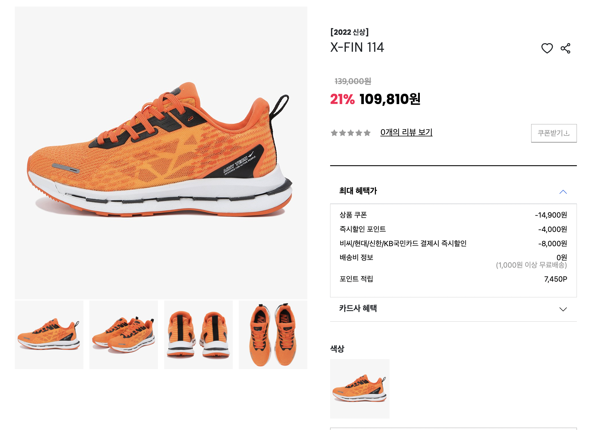

# 7 Team Project

#### 클론사이트 : 프로스펙스(Prospecs)[https://www.prospecs.com/display.do?cmd=mallMain]

<br/>

# 소개

#### ✅ 무엇을 위한 프로젝트인가?

#### 지금까지 배운 기술을 응용하고 개발 실력을 향상 시키기 위한 목적을 가지고 있습니다.

<br/>

# 기술 스택

> JavaScript

> React

> Vite

> styled-components

<br/>

# 프로젝트 설치 및 실행 방법

✅ 설치방법

1. Node.JS를 다운받아 설치해주세요. vite를 사용하였기 때문에 최소 14.18 버전 이상이 요구됩니다. https://nodejs.org/
2. 리포지토리를 클론해주세요.

```
 git clone https://github.com/wecode-bootcamp-korea/justcode-6-1st-pro-coders-front.git
```

3. dependencies를 설치해주세요.

```
npm install
```

✅ 실행방법

1. 다음 명령어를 이용해 Dev server를 실행해주세요.

```
npm run dev
```

2. 브라우저에서 <http://localhost:5173>에 접속해주세요.

<br/>

# 저작권, 라이선스 정보

#### [저작자] by prospecs

#### [이미지출처] https://www.prospecs.com

#### ✅ 모든 이미지의 저작권 사용은 자사의 허락을 맡아 제품사진만 사용 하였습니다.

<br/>

# 주요기능 및 설명

## ✅ SHOP > SHOES 카테고리별 제품 필터링


<br/>

## ✅ SHOP > SHOES 제품데이터별 정상가/할인율/할인가/성별 필터링



<br/>

## ✅ SHOP > SHOES 필터검색 클릭시 필터모달 등장



<br/>

## ✅ 제품 클릭시 해당 제품 상세페이지 이동



<br/>

## ✅ 메인페이지 및 Shop페이지 레이아웃 및 swiper 구현


## 로그인, 회원가입 레이아웃 및 유효성 검사, 로직 구현

## 상품

# 정보

### ✅ 팀원

> 이다익 - https://github.com/kkukileon305

> 봉원희 - https://github.com/2021Bong

> 최승철 - https://github.com/tmdcjf152

> 이신희 - https://github.com/shlee2227

> 조윤식 - https://github.com/younsik2

# 외부 리소스 정보
